<div align="center">

# 🏠 SmartHaven 2.0

### 🌿 Smart Environment Monitoring Mobile App

> **Monitor your environment. Understand your space. Build a smarter home.**

<p align="center">


</p>

<p align="center">


</p>

<p align="center">

</p>

---

</div>

# 📑 Table of Contents

* [🌟 About SmartHaven](#-about-smarthaven)
* [🎯 Project Objective](#-project-objective)
* [🧠 SmartHaven Entity Graph](#-smarthaven-entity-graph)
* [🏗️ Complete System Architecture](#️-complete-system-architecture)
* [🔄 Real-Time Data Flow](#-real-time-data-flow)
* [🧬 Entity Relationship Diagram](#-entity-relationship-diagram)
* [🧪 Offline Dummy Mode](#-offline-dummy-mode)
* [🤖 IoT Hardware Architecture](#-iot-hardware-architecture)
* [📡 Sensor Data Pipeline](#-sensor-data-pipeline)
* [🔐 Authentication Architecture](#-authentication-architecture)
* [🏠 Device Claiming](#-device-claiming)
* [🚨 Alert System](#-alert-system)
* [🎬 Animated UI](#-animated-ui)
* [🎨 UI/UX Design](#-uiux-design)
* [✨ Core Features](#-core-features)
* [🛠️ Technology Stack](#️-technology-stack)
* [📦 Dependencies](#-dependencies)
* [📊 Monitoring Parameters](#-monitoring-parameters)
* [📂 Project Structure](#-project-structure)
* [🚀 Installation](#-installation)
* [🔧 Project Setup](#-project-setup)
* [🔑 Environment Variables](#-environment-variables)
* [🧪 Running Demo Mode](#-running-demo-mode)
* [📸 Screenshots](#-screenshots)
* [🎥 Demo](#-demo)
* [🔄 Application Lifecycle](#-application-lifecycle)
* [📱 Responsive Design](#-responsive-design)
* [🌙 Theme System](#-theme-system)
* [📡 Device Status](#-device-status)
* [🔒 Security](#-security)
* [🧪 Testing](#-testing)
* [🗺️ Development Roadmap](#️-development-roadmap)
* [📚 Development Documentation](#-development-documentation)
* [🤝 Contributing](#-contributing)
* [📄 License](#-license)
* [👨‍💻 Developer](#-developer)

---

# 🌟 About SmartHaven

**SmartHaven 2.0** is a full-stack **IoT-based Smart Environment Monitoring Mobile App** that connects physical environmental sensors with a modern, animated and responsive mobile application.

The platform is designed to collect environmental information from IoT sensors, process the information through a backend system, transmit updates in real time and display the information through an easy-to-understand dashboard.

SmartHaven combines:

```text
                    🏠 SMART HAVEN 2.0

        ┌─────────────────────────────────────┐
        │                                     │
        │       🌿 Environment Monitoring     │
        │                                     │
        └──────────────────┬──────────────────┘
                           │
          ┌────────────────┼────────────────┐
          │                │                │
          ▼                ▼                ▼
       🤖 IoT           ☁️ Render          ⚛️ Mobile App
          │             Backend               │
          ▼                │                  ▼
       ESP32            REST API          React Native
       DHT11            Socket.IO         NativeWind
       MQ-02            Firebase          Reanimated
       OLED             Services           Expo
          │                │                  │
          └────────────────┼──────────────────┘
                           │
                           ▼
                     📊 Smart Dashboard
```

---

# 🎯 Project Objective

The primary goal of SmartHaven is to create a complete environment monitoring ecosystem where users can monitor environmental conditions from a centralized dashboard.

### Main objectives

* 🌡️ Monitor temperature
* 💧 Monitor humidity
* 💨 Monitor gas levels
* 🌿 Monitor Air Quality Index
* 📡 Connect IoT devices
* ⚡ Receive real-time sensor updates
* 🔐 Provide secure authentication
* 🏠 Allow device claiming
* 🚨 Display environmental alerts
* 🧪 Provide offline simulation
* 🎬 Create an interactive animated interface
* 📱 Support responsive layouts
* 📊 Prepare the foundation for future analytics

---

# 🧠 SmartHaven Entity Graph

The SmartHaven ecosystem connects the user, mobile application, authentication, IoT hardware, Render-hosted backend, database, real-time communication and monitoring systems.

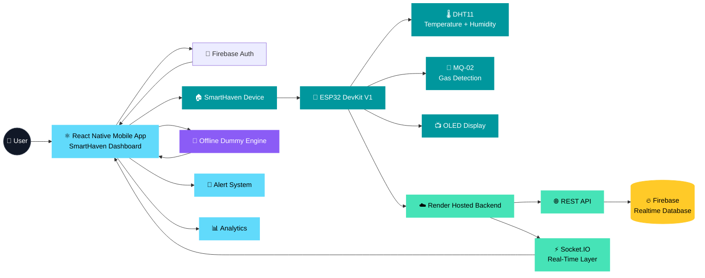

---

# 🏗️ Complete System Architecture

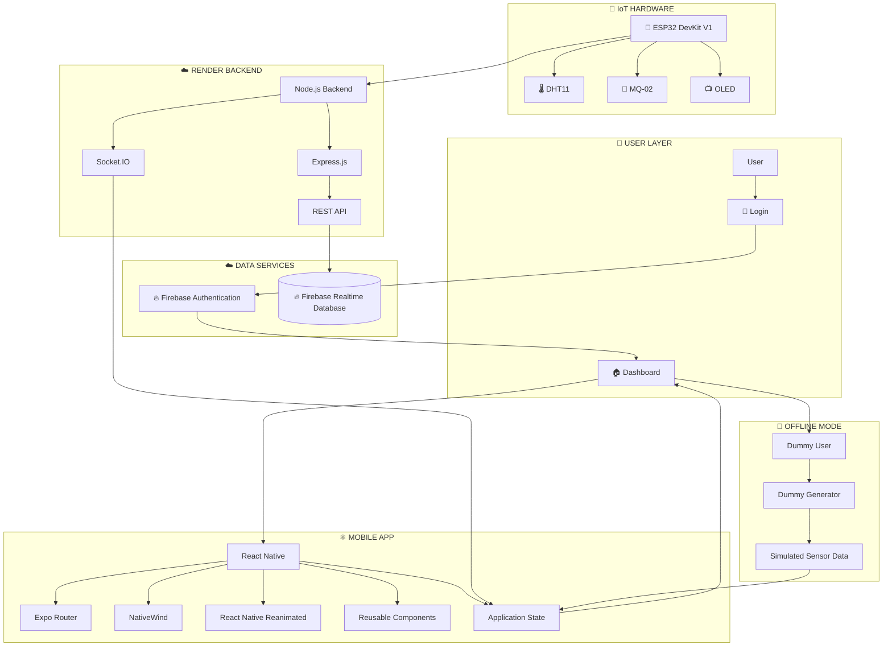

---

# 🔄 Real-Time Data Flow

SmartHaven uses a real-time communication layer to deliver environmental updates to the dashboard.

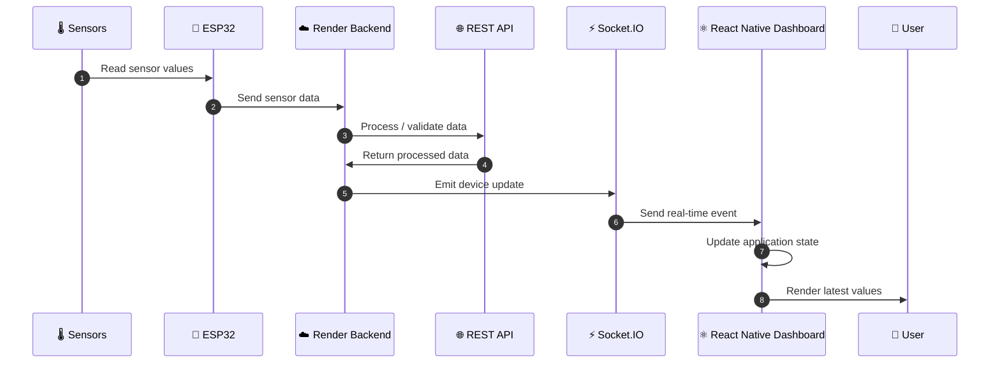

---

# 🧬 Entity Relationship Diagram

The logical SmartHaven data model can be represented as follows:

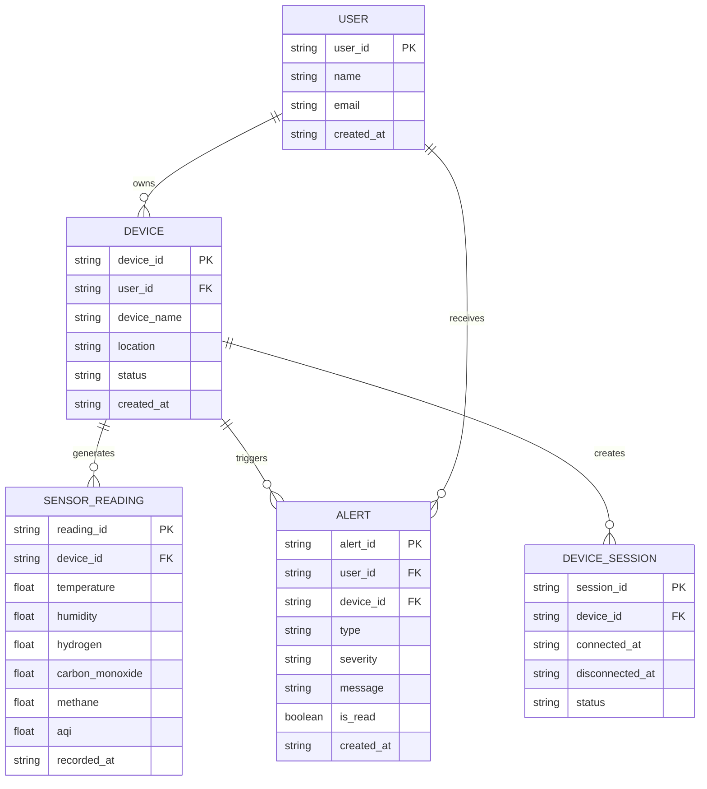

> **Note:** This represents the logical application/data relationship. The implementation schema can evolve as SmartHaven development continues.

---

# 🧪 Offline Dummy Mode

One of the important features of SmartHaven 2.0 is its **Dummy / Offline Mode**.

The dashboard can operate using simulated sensor values even when the physical ESP32 device or sensors are unavailable.

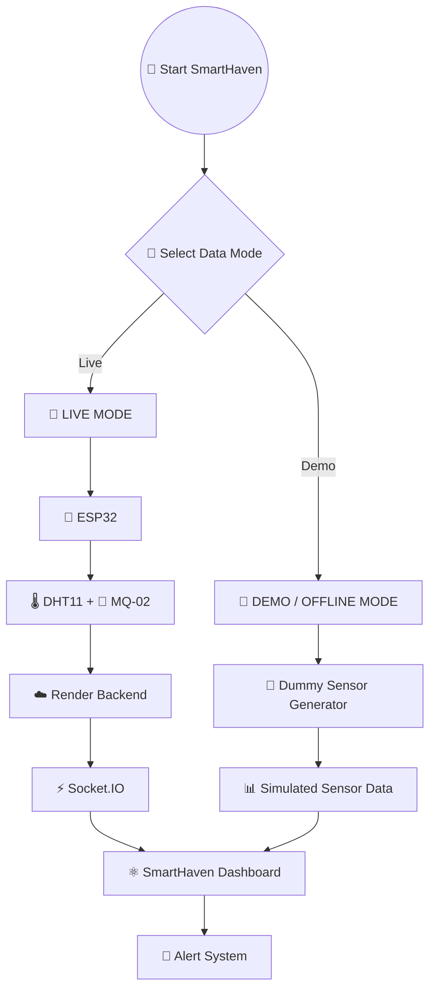

---

# 🎯 Dummy Mode Capabilities

Dummy Mode allows the application to:

* Run without physical hardware
* Run without ESP32
* Test the dashboard independently
* Simulate sensor readings
* Test alert states
* Test loading states
* Test responsive UI
* Test sidebar behavior
* Test dark/light mode
* Test animations
* Demonstrate the project easily

### Example simulated data

```text
┌──────────────────────────────────────────┐
│          🧪 DEMO MODE ACTIVE             │
├──────────────────────────────────────────┤
│                                          │
│  🌡️ Temperature       25.4 °C            │
│  💧 Humidity          56 %               │
│  💨 H₂                Normal             │
│  🏭 CO                Normal             │
│  🔥 CH₄               Normal             │
│  🌿 AQI               42                 │
│                                          │
│  ⚡ Simulated Real-Time Updates          │
│                                          │
└──────────────────────────────────────────┘
```

---

# 🔁 Dummy Data Architecture

```text
              🧪 Dummy User
                    │
                    ▼
             🧪 Dummy Device
                    │
                    ▼
          🧪 Dummy Sensor Engine
                    │
          ┌─────────┼─────────┐
          │         │         │
          ▼         ▼         ▼
         🌡️        💧        💨
     Temperature  Humidity   Gas
          │         │         │
          └─────────┼─────────┘
                    │
                    ▼
              📊 Sensor Data
                    │
                    ▼
             ⚛️ React Native State
                    │
                    ▼
             🏠 Dashboard
```

---

# 🤖 IoT Hardware Architecture

SmartHaven's hardware layer is centered around an **ESP32 DevKit V1**.

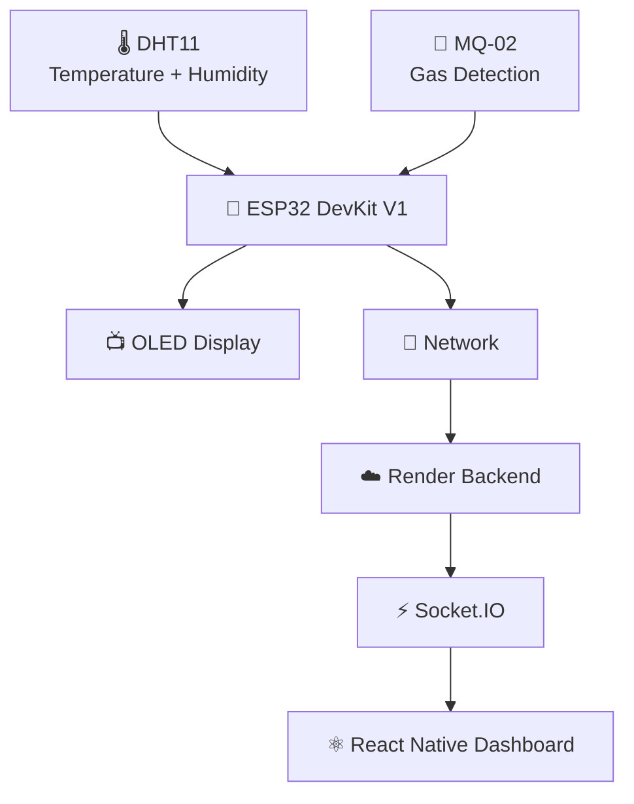

---

# 📡 Sensor Data Pipeline

```text
                     🌡️ DHT11
                         │
              ┌──────────┴──────────┐
              │                     │
              ▼                     ▼
        🌡️ Temperature        💧 Humidity
              │                     │
              └──────────┬──────────┘
                         │
                         ▼
                    🧠 ESP32
                         │
                         ▼
                     💨 MQ-02
                         │
              ┌──────────┼──────────┐
              │          │          │
              ▼          ▼          ▼
             H₂          CO         CH₄
              │          │          │
              └──────────┼──────────┘
                         │
                         ▼
                  ☁️ Render Backend
                         │
                         ▼
                    ⚡ Socket.IO
                         │
                         ▼
                  ⚛️ Dashboard
                         │
                         ▼
                   🚨 Alerts
```

---

# 🔐 Authentication Architecture

Firebase Authentication handles the user authentication layer.

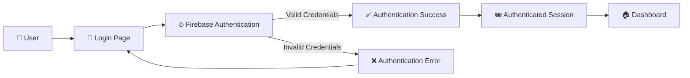

---

# 🔐 Authentication Features

* Email/password authentication
* Firebase Authentication
* Protected dashboard
* Login validation
* Authentication error handling
* Session-based application access
* Logout support
* Demo login support

---

# 🏠 Device Claiming

The device claiming system allows a user to associate a SmartHaven device with their account using a unique Device ID.

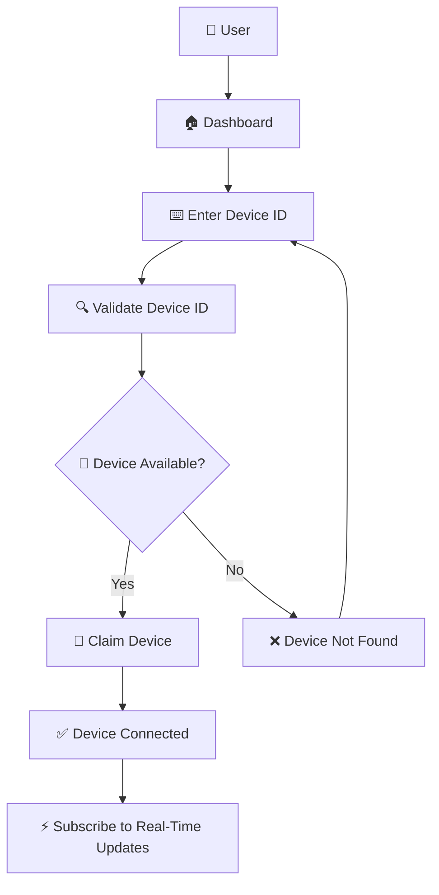

---

# 📡 Device Connection Flow

```text
👤 User
   │
   ▼
⌨️ Device ID
   │
   ▼
🔍 Validation
   │
   ▼
🏠 Device Found
   │
   ▼
🔗 Claim Device
   │
   ▼
📡 Device Connected
   │
   ▼
⚡ Real-Time Updates
   │
   ▼
📊 Dashboard
```

---

# 🚨 Environmental Alert System

SmartHaven can represent different environmental conditions through an alert system.

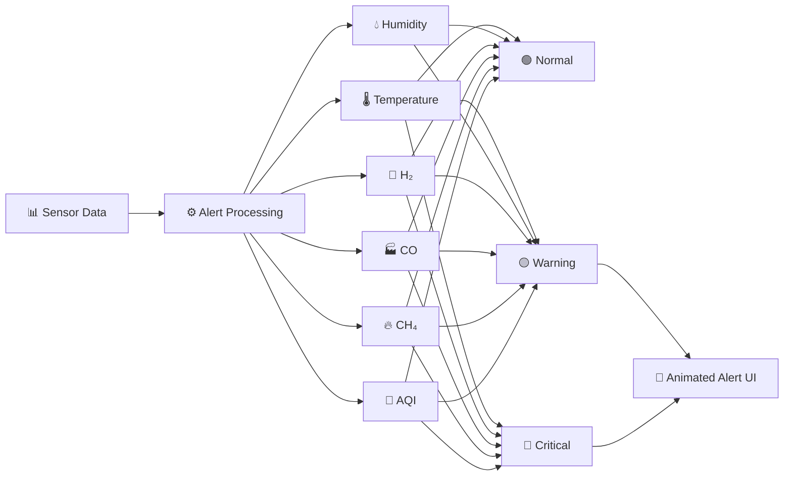

---

# 🎬 Animated UI

SmartHaven 2.0 uses **React Native Reanimated** to make the mobile interface feel smooth, interactive and responsive.

The animations are used for page transitions, sidebar interactions, sensor cards, alerts, modals, loading states, buttons, theme changes and live device updates.

---

# 🎨 UI / UX Design

SmartHaven is designed as a modern environment monitoring dashboard.

### Design principles

```text
          🏠 SMART HAVEN UI
                  │
       ┌──────────┼──────────┐
       │          │          │
       ▼          ▼          ▼
    Clarity    Feedback    Motion
       │          │          │
       ▼          ▼          ▼
    Data UI     Alerts     React Native Reanimated
       │          │          │
       └──────────┼──────────┘
                  ▼
             Better UX
```

---

# 🎨 UI Features

* ✨ Modern dashboard cards
* 🌙 Dark Mode
* ☀️ Light Mode
* 🧭 Responsive Sidebar
* 📱 Responsive Dashboard
* 🎬 Smooth transitions
* 🚨 Custom alerts
* 🪟 Custom modals
* 🔄 Loading states
* 📡 Device status
* 👤 User profile
* ⏱️ Last updated information
* 🎯 Interactive controls
* 🧪 Demo mode indicator

---

# ✨ Core Features

## 🔐 Authentication

* Firebase email/password authentication
* Login UI
* Validation
* Error handling
* Protected dashboard
* Logout
* Demo login

---

## 🏠 Smart Dashboard

Dashboard provides a centralized view of the environment.

Includes:

* Temperature
* Humidity
* H₂
* CO
* CH₄
* AQI
* Device status
* Last updated time

---

## 📡 Device Management

* Device ID input
* Device validation
* Device claiming
* Connection state
* Device status
* Real-time device updates

---

## 🌿 Environment Monitoring

SmartHaven monitors:

```text
🌡️ Temperature
💧 Humidity
💨 H₂
🏭 CO
🔥 CH₄
🌿 AQI
```

---

## 🧪 Demo Mode

* Dummy user
* Dummy device
* Dummy sensor values
* Simulated updates
* No hardware required
* UI testing
* Project demonstration

---

## 🌙 Theme

* Light Mode
* Dark Mode
* Theme-aware components
* Smooth theme transition

---

## 📱 Responsive

Designed for:

* 🖥️ Desktop / Large Display
* 💻 Tablet
* 📱 Mobile
* 📱 Small Mobile

---

# 🛠️ Technology Stack

## ⚛️ Mobile App

| Technology                 | Purpose                   |
| -------------------------- | ------------------------- |
| ⚛️ React Native            | Mobile application        |
| ⚡ Expo                     | Development and build     |
| 🟨 JavaScript              | Application logic         |
| 🎨 NativeWind              | Utility-first styling     |
| 🧭 Expo Router             | File-based navigation     |
| 🧭 React Navigation        | Navigation infrastructure |
| 🎬 React Native Reanimated | Animations                |
| 🧩 Lucide React Native     | Icons                     |
| 🖼️ Expo Image             | Image rendering           |
| 📱 Expo Status Bar         | Status bar management     |
| 🎯 Expo Vector Icons       | Icon support              |

---

## ☁️ Backend

SmartHaven uses a **hosted backend deployed on Render**.

The backend is not maintained as a local backend application inside the mobile repository.

| Technology    | Purpose                     |
| ------------- | --------------------------- |
| ☁️ Render     | Backend hosting             |
| 🟢 Node.js    | Backend runtime             |
| 🚂 Express.js | REST API                    |
| ⚡ Socket.IO   | Real-time communication     |
| 🌐 REST API   | Client-server communication |

> The React Native application connects to the deployed Render backend through its configured backend URL.

---

## 🔥 Firebase

Used for:

* 🔐 Authentication
* 🔄 Realtime Database
* 👤 User management
* ☁️ Cloud services

---

## 🤖 IoT Stack

| Component          | Purpose                  |
| ------------------ | ------------------------ |
| 🧠 ESP32 DevKit V1 | Main IoT controller      |
| 🌡️ DHT11          | Temperature and humidity |
| 💨 MQ-02           | Gas detection            |
| 📺 OLED Display    | Local sensor information |

---

# 🧩 Complete Technology Mindmap

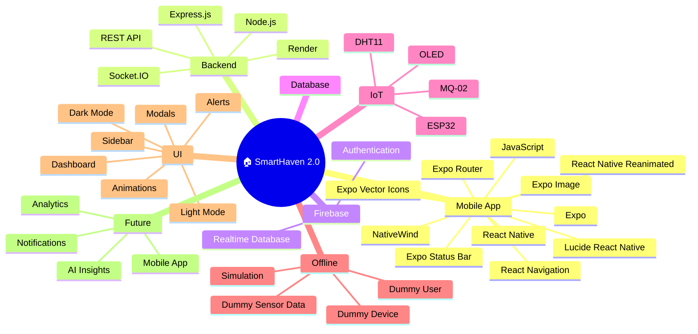

---

# 📦 Dependencies

## Mobile App Packages

```text
@expo/vector-icons
@react-navigation/native
react-native-screens
react-native-safe-area-context
@react-navigation/bottom-tabs
expo-router
expo-image
expo-status-bar
firebase
socket.io-client
lucide-react-native
nativewind
react-native-reanimated
```

### Installation

```bash
npm i @expo/vector-icons

npm install @react-navigation/native

npx expo install react-native-screens react-native-safe-area-context

npm install @react-navigation/bottom-tabs

npm i expo-router

npm i react-native-screens

npm i expo-image

npm i expo-status-bar

npm i firebase

npm i socket.io-client

npm install lucide-react-native
```

### NativeWind

```bash
npm install nativewind
npm install --save-dev tailwindcss
```

> NativeWind configuration is part of the project setup documented in `STEP.md`.

---

# 📊 Monitoring Parameters

| Parameter        | Sensor / Source | Unit      | Dashboard |
| ---------------- | --------------- | --------- | :-------: |
| 🌡️ Temperature  | DHT11           | °C        |     ✅     |
| 💧 Humidity      | DHT11           | %         |     ✅     |
| 💨 H₂            | MQ-02           | Gas Level |     ✅     |
| 🏭 CO            | MQ-02           | Gas Level |     ✅     |
| 🔥 CH₄           | MQ-02           | Gas Level |     ✅     |
| 🌿 AQI           | Processed Data  | Index     |     ✅     |
| 📡 Device Status | Device          | State     |     ✅     |
| ⏱️ Last Updated  | Application     | Time      |     ✅     |

---

# 📂 Project Structure

```text
SmartHaven-2.0/
│
├── 📁 app/
│   ├── _layout.jsx
│   ├── index.jsx
│   ├── login/
│   ├── dashboard/
│   └── tabs/
│
├── 📁 components/
│   ├── Sidebar.jsx
│   ├── DashboardHeader.jsx
│   ├── SensorCard.jsx
│   ├── Alert.jsx
│   ├── Modal.jsx
│   └── ...
│
├── 📁 src/
│   │
│   ├── 📁 assets/
│   │
│   ├── 📁 services/
│   │   ├── firebase.js
│   │   └── socket.js
│   │
│   ├── 📁 db/
│   │   └── dummyData.js
│   │
│   ├── 📁 hooks/
│   │
│   ├── 📁 context/
│   │
│   └── ...
│
├── 📁 iot/
│   ├── 📁 esp32/
│   ├── 📁 sensors/
│   └── README.md
│
├── 📁 public/
│   ├── 📁 screenshots/
│   └── 📁 demo/
│
├── 📄 README.md
├── 📄 STEP.md
├── 📄 .gitignore
├── 📄 tailwind.config.js
├── 📄 app.json
└── 📄 package.json
```

> **Note:** The backend is hosted separately on Render and is therefore not represented as a local `backend/` directory in the mobile repository.

---

# 🚀 Installation

## 1️⃣ Clone Repository

```bash
git clone https://github.com/your-username/smarthaven-2.0.git
```

```bash
cd smarthaven-2.0
```

---

## ⚛️ Mobile App Setup

Install project dependencies:

```bash
npm install
```

Start the Expo development server:

```bash
npx expo start
```

The application can then be opened using the available Expo development options.

---

# 🔧 Project Setup

The detailed project setup is documented separately in:

```text
STEP.md
```

The setup includes:

```text
01. Expo Project Setup
        ↓
02. Dependency Installation
        ↓
03. NativeWind Setup
        ↓
04. Expo Router Setup
        ↓
05. React Navigation Setup
        ↓
06. Firebase Setup
        ↓
07. Socket.IO Client Setup
        ↓
08. Render Backend Connection
        ↓
09. Project Structure
        ↓
10. UI Components
        ↓
11. Authentication
        ↓
12. Dashboard
        ↓
13. Dummy Mode
        ↓
14. Device Management
        ↓
15. Real-Time Monitoring
        ↓
16. Alerts
        ↓
17. Animations
        ↓
18. Testing
```

---

# ☁️ Render Backend

SmartHaven uses a backend hosted on **Render**.

```text
                    ⚛️ React Native App
                            │
                            │
                 HTTPS / Socket.IO
                            │
                            ▼
                    ☁️ Render Backend
                            │
              ┌─────────────┴─────────────┐
              │                           │
              ▼                           ▼
          🌐 REST API                 ⚡ Socket.IO
              │                           │
              └─────────────┬─────────────┘
                            ▼
                     📊 Sensor Data
```

The mobile application only needs the deployed backend URL.

Example:

```env
EXPO_PUBLIC_BACKEND_URL=https://your-backend.onrender.com
```

> Replace the example URL with the actual Render backend URL used by the project.

---

# 🔑 Environment Variables

## Mobile App `.env`

```env
EXPO_PUBLIC_BACKEND_URL=https://your-backend.onrender.com

EXPO_PUBLIC_FIREBASE_API_KEY=your_api_key
EXPO_PUBLIC_FIREBASE_AUTH_DOMAIN=your_auth_domain
EXPO_PUBLIC_FIREBASE_PROJECT_ID=your_project_id
EXPO_PUBLIC_FIREBASE_STORAGE_BUCKET=your_storage_bucket
EXPO_PUBLIC_FIREBASE_MESSAGING_SENDER_ID=your_sender_id
EXPO_PUBLIC_FIREBASE_APP_ID=your_app_id
```

> Expo client-side variables intended for application use should use the `EXPO_PUBLIC_` prefix.

---

## Firebase Configuration

Example:

```js
import { initializeApp } from "firebase/app";

const firebaseConfig = {
  apiKey: process.env.EXPO_PUBLIC_FIREBASE_API_KEY,
  authDomain: process.env.EXPO_PUBLIC_FIREBASE_AUTH_DOMAIN,
  projectId: process.env.EXPO_PUBLIC_FIREBASE_PROJECT_ID,
  storageBucket: process.env.EXPO_PUBLIC_FIREBASE_STORAGE_BUCKET,
  messagingSenderId: process.env.EXPO_PUBLIC_FIREBASE_MESSAGING_SENDER_ID,
  appId: process.env.EXPO_PUBLIC_FIREBASE_APP_ID,
};

const app = initializeApp(firebaseConfig);

export default app;
```

---

# ⚡ Socket.IO Client

The React Native application connects to the Render-hosted backend using `socket.io-client`.

Example:

```js
import { io } from "socket.io-client";

const socket = io(process.env.EXPO_PUBLIC_BACKEND_URL);

export default socket;
```

Data flow:

```text
ESP32
   ↓
☁️ Render Backend
   ↓
⚡ Socket.IO
   ↓
📱 React Native
   ↓
📊 Application State
   ↓
🏠 Dashboard
```

---

# 🧪 Running Demo Mode

SmartHaven can run without physical hardware.

### Step 1 — Install Dependencies

```bash
npm install
```

### Step 2 — Start Mobile App

```bash
npx expo start
```

### Step 3 — Open Application

Use the Expo development environment to launch the application.

### Step 4 — Use Demo Login

Use the application's demo login functionality.

### Step 5 — Dummy Device

The application loads the dummy device configuration.

### Step 6 — Sensor Simulation

The dummy engine generates changing environmental values.

### Step 7 — Dashboard

The simulated data appears inside the sensor cards.

```text
🧪 Dummy Generator
       ↓
📊 Sensor Values
       ↓
⚛️ React Native State
       ↓
🏠 Dashboard
       ↓
🚨 Alerts
```

---

# 📸 Screenshots

Create the following directory:

```text
public/
└── screenshots/
```

Recommended screenshots:

```text
login.png
dashboard.png
dark-mode.png
device-claim.png
alerts.png
mobile.png
```

---

## 🔐 Login Screen

```markdown

```

---

## 🏠 Dashboard

```markdown

```

---

## 🌙 Dark Mode

```markdown

```

---

## 🔗 Device Claiming

```markdown

```

---

## 🚨 Alerts

```markdown

```

---

## 📱 Mobile

```markdown

```

---

# 🎥 Project Demo

For a more professional GitHub presentation, add a GIF or short screen recording.

Recommended structure:

```text
public/
└── demo/
    └── smarthaven-demo.gif
```

Then add:

```markdown
<p align="center">


</p>
```

### Recommended demo sequence

```text
🔐 Login
   ↓
🏠 Dashboard
   ↓
🧭 Sidebar
   ↓
🌙 Dark Mode
   ↓
📡 Device Status
   ↓
🧪 Dummy Sensor Updates
   ↓
🚨 Alert
   ↓
📊 Monitoring
```

---

# 🔄 Application Lifecycle

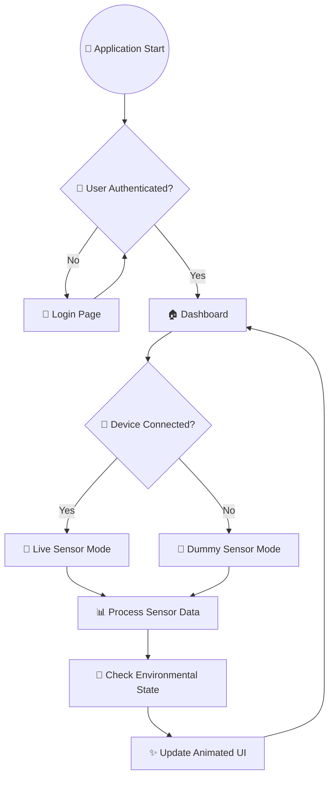

---

# 📱 Responsive Design

SmartHaven is designed to adapt to different screen sizes.

```text
                  🏠 SMART HAVEN
                         │
          ┌──────────────┼──────────────┐
          │              │              │
          ▼              ▼              ▼
       🖥️ Large       💻 Tablet      📱 Mobile
          │              │              │
          ▼              ▼              ▼
     Expanded UI     Responsive UI   ☰ Sidebar
          │              │              │
          ▼              ▼              ▼
       Dashboard      Dashboard      Compact Cards
```

### Large Screens

* Expanded dashboard
* Multiple sensor cards
* Complete monitoring information

### Tablet

* Responsive card layout
* Adaptive spacing
* Flexible navigation

### Mobile

* Collapsible sidebar
* Compact cards
* Mobile header
* Touch-friendly controls

---

# 🌙 Theme System

SmartHaven includes both Light and Dark themes.

## ☀️ Light Mode

Designed for bright environments with a clean interface.

## 🌙 Dark Mode

Designed for comfortable monitoring in low-light environments.

Theme-aware elements include:

```text
🧭 Sidebar
📌 Header
📊 Sensor Cards
🚨 Alerts
🪟 Modals
🎯 Buttons
📄 Pages
🏠 Dashboard
```

NativeWind theme example:

```jsx
<View className="bg-white dark:bg-slate-950">
    <Text className="text-slate-900 dark:text-white">
        SmartHaven
    </Text>
</View>
```

---

# 📡 Device Status

The dashboard provides different visual device states.

```text
🟢 ONLINE

Device is connected and available.


🟡 CONNECTING

Connection is being established.


🔴 OFFLINE

Device is currently unavailable.


🧪 DEMO

Dummy / simulated sensor mode is active.
```

---

# 📊 Monitoring Overview

```text
                         🏠 SMART HAVEN
                                │
             ┌──────────────────┼──────────────────┐
             │                  │                  │
             ▼                  ▼                  ▼
       🌡️ Temperature      💧 Humidity          🌿 AQI
             │                  │                  │
             └──────────────────┼──────────────────┘
                                │
                     ┌──────────┴──────────┐
                     │                     │
                     ▼                     ▼
                  💨 H₂                   🏭 CO
                     │                     │
                     └──────────┬──────────┘
                                │
                                ▼
                             🔥 CH₄
                                │
                                ▼
                         🚨 Alert System
                                │
                                ▼
                          ⚛️ Dashboard
```

---

# 🧪 Testing

SmartHaven can be tested at multiple layers.

## Mobile App Testing

Check:

* Login UI
* Dashboard
* Sidebar
* Theme switching
* Responsive layout
* Sensor cards
* Alerts
* Modals
* Loading states
* Dummy mode

---

## Render Backend Testing

Check:

* Render service availability
* REST API communication
* Authentication validation
* Device claiming
* Database connectivity
* Socket.IO connection
* Mobile-to-backend communication

---

## IoT Testing

Check:

* ESP32 connection
* DHT11 readings
* MQ-02 readings
* OLED display
* Network communication
* Render backend communication

---

## Offline Testing

Check:

```text
🧪 Dummy Login
      ↓
🧪 Dummy Device
      ↓
🧪 Sensor Simulation
      ↓
📊 Dashboard
      ↓
🚨 Alerts
```

---

# 🔒 Security

SmartHaven follows basic application security practices.

### 🔐 Authentication

Firebase Authentication provides the authentication layer.

### 🔑 Environment Variables

Sensitive configuration values should be stored in `.env`.

### 🛡️ Protected APIs

The Render-hosted backend can validate authenticated requests.

### 🏠 Device Validation

Device IDs should be validated before device claiming.

### 🚫 Secrets

Never commit:

```text
.env
Private Keys
Passwords
API Secrets
Firebase Admin Credentials
Database Credentials
```

---

# 🗺️ Development Roadmap

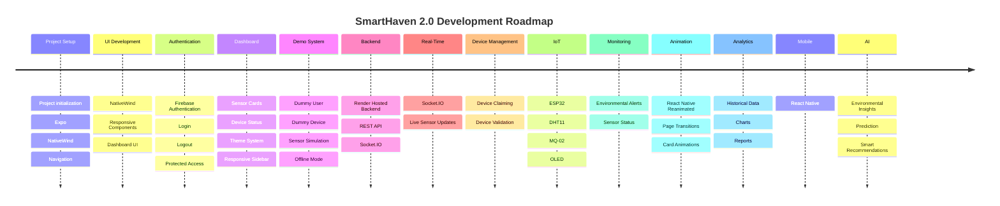

---

# 📈 Future Analytics

Future versions can include:

* 📊 Historical sensor data
* 📈 Interactive charts
* 📅 Daily reports
* 📅 Weekly reports
* 📅 Monthly reports
* 🔍 Data filtering
* 📤 Data export
* 📉 Environmental trends

---

# 🤖 Future AI Features

Potential future AI functionality:

```text
                🤖 AI ENGINE
                     │
        ┌────────────┼────────────┐
        │            │            │
        ▼            ▼            ▼
   📊 Analysis   🔍 Anomaly    🔮 Prediction
        │         Detection        │
        │            │              │
        └────────────┼──────────────┘
                     ▼
              💡 Smart Insights
                     │
                     ▼
                👤 User
```

Potential features:

* Environmental trend analysis
* Anomaly detection
* AQI prediction
* Smart recommendations
* Environmental summaries
* Pattern detection

---

# 📱 Future Mobile Application

A future React Native application can provide:

* 📱 Mobile dashboard
* 🔐 Authentication
* 📡 Device management
* 📊 Sensor monitoring
* 🚨 Push notifications
* 📈 Analytics
* 🌙 Dark mode

---

# 🏠 Future Multi-Device Architecture

SmartHaven can eventually support multiple devices.

```text
                         👤 User
                           │
                           ▼
                    🏠 SmartHaven
                           │
             ┌─────────────┼─────────────┐
             │             │             │
             ▼             ▼             ▼
         📡 Device 1   📡 Device 2   📡 Device 3
             │             │             │
             ▼             ▼             ▼
          Room 1        Room 2        Room 3
             │             │             │
             └─────────────┼─────────────┘
                           ▼
                     📊 Central Dashboard
```

---

# 📚 Development Documentation

The project development process is documented separately in:

```text
STEP.md
```

The document follows the chronological development process of SmartHaven.

```text
01. Project Setup
        ↓
02. Mobile App Setup
        ↓
03. NativeWind Configuration
        ↓
04. Navigation Setup
        ↓
05. Firebase Setup
        ↓
06. Authentication
        ↓
07. Login UI
        ↓
08. Dashboard
        ↓
09. Sidebar
        ↓
10. Dark / Light Mode
        ↓
11. Sensor Cards
        ↓
12. Dummy Mode
        ↓
13. Dummy Sensor Generator
        ↓
14. Render Backend Connection
        ↓
15. REST API Integration
        ↓
16. Socket.IO Client
        ↓
17. Device Claiming
        ↓
18. IoT Integration
        ↓
19. Real-Time Data
        ↓
20. Alerts
        ↓
21. Animations
        ↓
22. Testing
        ↓
23. Deployment
```

---

# 📝 Development Philosophy

SmartHaven is being developed around three major principles:

### 1. 🧩 Modular

Components and services should remain reusable and maintainable.

### 2. ⚡ Real-Time

Environmental data should be available to the dashboard with minimal delay.

### 3. 🎨 User-Friendly

Complex sensor information should be represented through simple visual interfaces.

---

# 🌐 Deployment Architecture

The application uses a hosted backend architecture.

```text
                         🌍 INTERNET
                              │
                 ┌────────────┴────────────┐
                 │                         │
                 ▼                         ▼
          📱 React Native App        ☁️ Render Backend
                 │                         │
                 │                    REST API
                 │                         │
                 │                    Socket.IO
                 │                         │
                 └────────────┬────────────┘
                              │
                   ┌──────────┴──────────┐
                   │                     │
                   ▼                     ▼
             🔥 Firebase              🤖 IoT
             Authentication          ESP32 Sensors
```

---

# 🚀 Production Checklist

Before deployment:

```text
☐ Configure production environment variables

☐ Configure Firebase Authentication

☐ Configure Firebase database

☐ Configure Render backend URL

☐ Configure CORS

☐ Test authentication

☐ Test device claiming

☐ Test Socket.IO

☐ Test dummy mode

☐ Test responsive UI

☐ Test dark mode

☐ Test alerts

☐ Remove development secrets

☐ Build mobile

☐ Verify Render backend

☐ Test production application
```

---

# 🤝 Contributing

Contributions, improvements and suggestions are welcome.

### 1️⃣ Create a branch

```bash
git checkout -b feature/your-feature
```

### 2️⃣ Make changes

```bash
git add .
```

### 3️⃣ Commit changes

```bash
git commit -m "Add your feature"
```

### 4️⃣ Push branch

```bash
git push origin feature/your-feature
```

### 5️⃣ Create Pull Request

Open a Pull Request with a clear description of your changes.

---

# 🐛 Bug Reports

When reporting an issue, include:

```text
1. Description of the problem

2. Steps to reproduce

3. Expected behavior

4. Actual behavior

5. Browser / device

6. Console error

7. Screenshots if available
```

---

# 💡 Feature Requests

Feature requests should include:

```text
Feature Name
        ↓
Problem
        ↓
Proposed Solution
        ↓
Expected Benefit
```

---

# 📄 License

This project is currently intended for:

* Educational purposes
* IoT experimentation
* Development
* Project demonstrations
* Learning
* Portfolio purposes

A formal open-source license can be added according to the project's final distribution requirements.

---

# 👨‍💻 Developer

<div align="center">

# Abhishek Kumar Jaiswar

### React Native Developer • Full Stack Developer • IoT • AI/ML

<br/>

<a href="https://github.com/abhishekkjaiml">

</a>

<a href="https://www.linkedin.com/in/abhishek-kumar-jaiswar-aiml/">

</a>

<br/><br/>

</div>

---

<div align="center">

# 🌿 SmartHaven 2.0

<p align="center">


</p>

<p align="center">

**🌿 Monitor • 📡 Connect • ⚡ Analyze • 🧪 Simulate • 🏠 Improve**

</p>

<p align="center">


</p>

---

<div align="center">

### 🏠 Built with ❤️ by Abhishek Kumar Jaiswar

**SmartHaven 2.0 — Monitor smarter. Live better.**

</div>

</div>
