<div align="center">

# 🏠 SmartHaven 2.0

### 🌿 Smart Environment Monitoring Mobile App

> **Monitor your environment. Understand your space. Build a smarter home.**

<p align="center">


</p>

<p align="center">


</p>

<p align="center">


</p>

---

</div>

# 📑 Table of Contents

* [🌟 About SmartHaven](#-about-smarthaven)
* [🎯 Project Objective](#-project-objective)
* [🧠 SmartHaven Entity Graph](#-smarthaven-entity-graph)
* [🏗️ Complete System Architecture](#️-complete-system-architecture)
* [🔄 Real-Time Data Flow](#-real-time-data-flow)
* [🧬 Entity Relationship Diagram](#-entity-relationship-diagram)
* [🧪 Offline Dummy Mode](#-offline-dummy-mode)
* [🤖 IoT Hardware Architecture](#-iot-hardware-architecture)
* [📡 Sensor Data Pipeline](#-sensor-data-pipeline)
* [🔐 Authentication Architecture](#-authentication-architecture)
* [🏠 Device Claiming](#-device-claiming)
* [🚨 Alert System](#-alert-system)
* [🎬 Animated UI](#-animated-ui)
* [🎨 UI/UX Design](#-uiux-design)
* [✨ Core Features](#-core-features)
* [🛠️ Technology Stack](#️-technology-stack)
* [📦 Dependencies](#-dependencies)
* [📊 Monitoring Parameters](#-monitoring-parameters)
* [📂 Project Structure](#-project-structure)
* [🚀 Installation](#-installation)
* [🔑 Environment Variables](#-environment-variables)
* [🧪 Running Demo Mode](#-running-demo-mode)
* [📸 Screenshots](#-screenshots)
* [🎥 Demo](#-demo)
* [🔄 Application Lifecycle](#-application-lifecycle)
* [📱 Responsive Design](#-responsive-design)
* [🌙 Theme System](#-theme-system)
* [📡 Device Status](#-device-status)
* [🔒 Security](#-security)
* [🧪 Testing](#-testing)
* [🗺️ Development Roadmap](#️-development-roadmap)
* [📚 Development Documentation](#-development-documentation)
* [🤝 Contributing](#-contributing)
* [📄 License](#-license)
* [👨‍💻 Developer](#-developer)

---

# 🌟 About SmartHaven

**SmartHaven 2.0** is a full-stack **IoT-based Smart Environment Monitoring Mobile App** that connects physical environmental sensors with a modern, animated and responsive mobile application.

The platform is designed to collect environmental information from IoT sensors, process the information through a backend system, transmit updates in real time and display the information through an easy-to-understand dashboard.

SmartHaven combines:

```text
                    🏠 SMART HAVEN 2.0

        ┌─────────────────────────────────────┐
        │                                     │
        │       🌿 Environment Monitoring     │
        │                                     │
        └──────────────────┬──────────────────┘
                           │
          ┌────────────────┼────────────────┐
          │                │                │
          ▼                ▼                ▼
       🤖 IoT           ⚙️ Backend        ⚛️ Mobile App
          │                │                │
          ▼                ▼                ▼
       ESP32            Node.js          React Native Native
       DHT11            Express          Tailwind
       MQ-02            Socket.IO        React Native Reanimated
       OLED             REST API         Firebase
          │                │                │
          └────────────────┼────────────────┘
                           │
                           ▼
                     📊 Smart Dashboard
```

---

# 🎯 Project Objective

The primary goal of SmartHaven is to create a complete environment monitoring ecosystem where users can monitor environmental conditions from a centralized dashboard.

### Main objectives

* 🌡️ Monitor temperature
* 💧 Monitor humidity
* 💨 Monitor gas levels
* 🌿 Monitor Air Quality Index
* 📡 Connect IoT devices
* ⚡ Receive real-time sensor updates
* 🔐 Provide secure authentication
* 🏠 Allow device claiming
* 🚨 Display environmental alerts
* 🧪 Provide offline simulation
* 🎬 Create an interactive animated interface
* 📱 Support responsive layouts
* 📊 Prepare the foundation for future analytics

---

# 🧠 SmartHaven Entity Graph

The SmartHaven ecosystem connects the user, mobile, authentication, IoT hardware, backend, databases, real-time communication and monitoring systems.

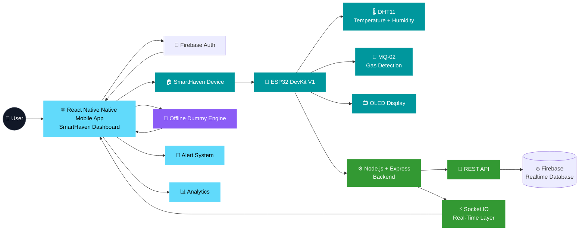

---

# 🏗️ Complete System Architecture

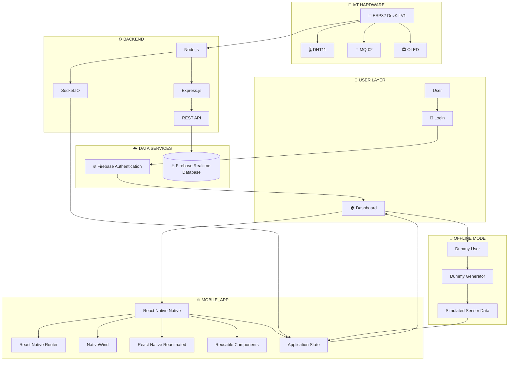

---

# 🔄 Real-Time Data Flow

SmartHaven uses a real-time communication layer to deliver environmental updates to the dashboard.


---

# 🧬 Entity Relationship Diagram

The logical SmartHaven data model can be represented as follows:

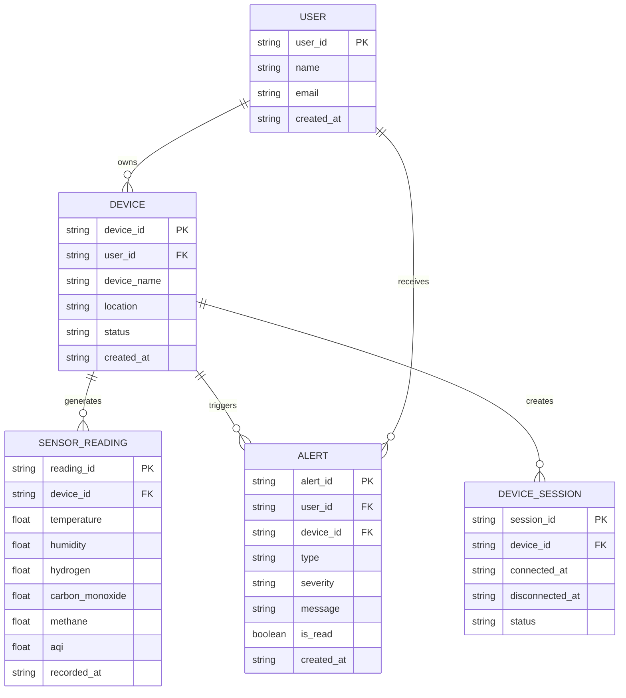

> **Note:** This represents the logical application/data relationship. The implementation schema can evolve as SmartHaven development continues.

---

# 🧪 Offline Dummy Mode

One of the important features of SmartHaven 2.0 is its **Dummy / Offline Mode**.

The dashboard can operate using simulated sensor values even when the physical ESP32 device or sensors are unavailable.

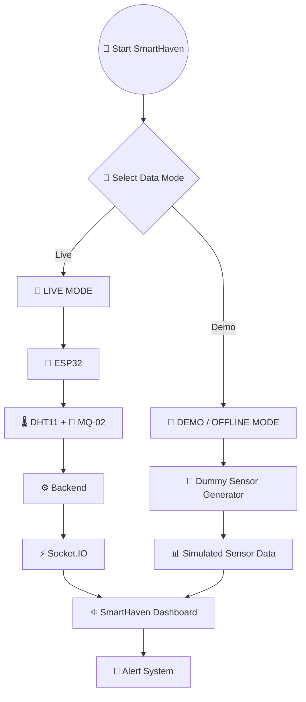

---

# 🎯 Dummy Mode Capabilities

Dummy Mode allows the application to:

* Run without physical hardware
* Run without ESP32
* Test the dashboard independently
* Simulate sensor readings
* Test alert states
* Test loading states
* Test responsive UI
* Test sidebar behavior
* Test dark/light mode
* Test animations
* Demonstrate the project easily

### Example simulated data

```text
┌──────────────────────────────────────────┐
│          🧪 DEMO MODE ACTIVE             │
├──────────────────────────────────────────┤
│                                          │
│  🌡️ Temperature       25.4 °C             │
│  💧 Humidity          56 %               │
│  💨 H₂                Normal             │
│  🏭 CO                Normal             │
│  🔥 CH₄               Normal             │
│  🌿 AQI               42                 │
│                                          │
│  ⚡ Simulated Real-Time Updates          │
│                                          │
└──────────────────────────────────────────┘
```

---

# 🔁 Dummy Data Architecture

```text
              🧪 Dummy User
                    │
                    ▼
             🧪 Dummy Device
                    │
                    ▼
          🧪 Dummy Sensor Engine
                    │
          ┌─────────┼─────────┐
          │         │         │
          ▼         ▼         ▼
         🌡️        💧        💨
     Temperature  Humidity   Gas
          │         │         │
          └─────────┼─────────┘
                    │
                    ▼
              📊 Sensor Data
                    │
                    ▼
             ⚛️ React Native State
                    │
                    ▼
             🏠 Dashboard
```

---

# 🤖 IoT Hardware Architecture

SmartHaven's hardware layer is centered around an **ESP32 DevKit V1**.

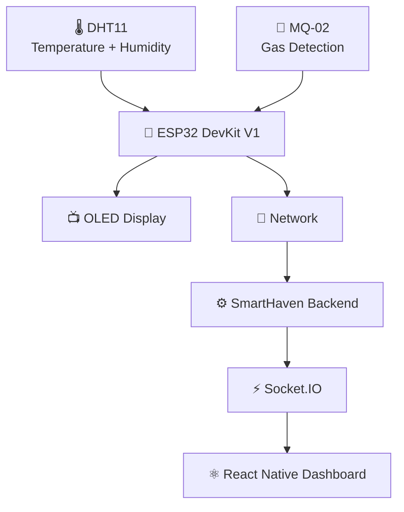

---

# 📡 Sensor Data Pipeline

```text
                     🌡️ DHT11
                         │
              ┌──────────┴──────────┐
              │                     │
              ▼                     ▼
        🌡️ Temperature        💧 Humidity
              │                     │
              └──────────┬──────────┘
                         │
                         ▼
                    🧠 ESP32
                         │
                         ▼
                     💨 MQ-02
                         │
              ┌──────────┼──────────┐
              │          │          │
              ▼          ▼          ▼
             H₂          CO         CH₄
              │          │          │
              └──────────┼──────────┘
                         │
                         ▼
                  ⚙️ Backend
                         │
                         ▼
                    ⚡ Socket.IO
                         │
                         ▼
                  ⚛️ Dashboard
                         │
                         ▼
                   🚨 Alerts
```

---

# 🔐 Authentication Architecture

Firebase Authentication handles the user authentication layer.

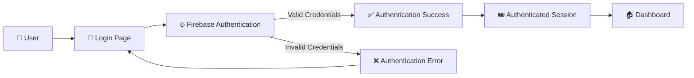

---

# 🔐 Authentication Features

* Email/password authentication
* Firebase Authentication
* Protected dashboard
* Login validation
* Authentication error handling
* Session-based application access
* Logout support
* Demo login support

---

# 🏠 Device Claiming

The device claiming system allows a user to associate a SmartHaven device with their account using a unique Device ID.

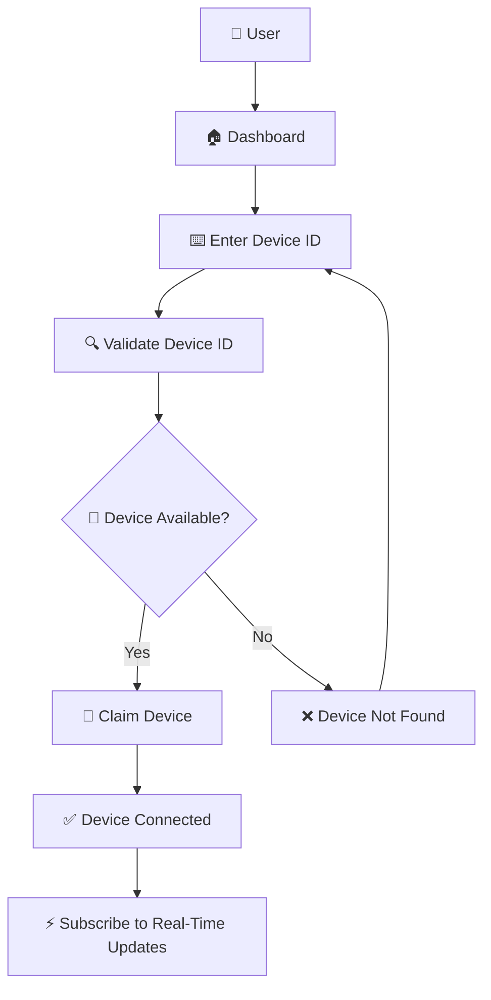

---

# 📡 Device Connection Flow

```text
👤 User
   │
   ▼
⌨️ Device ID
   │
   ▼
🔍 Validation
   │
   ▼
🏠 Device Found
   │
   ▼
🔗 Claim Device
   │
   ▼
📡 Device Connected
   │
   ▼
⚡ Real-Time Updates
   │
   ▼
📊 Dashboard
```

---

# 🚨 Environmental Alert System

SmartHaven can represent different environmental conditions through an alert system.

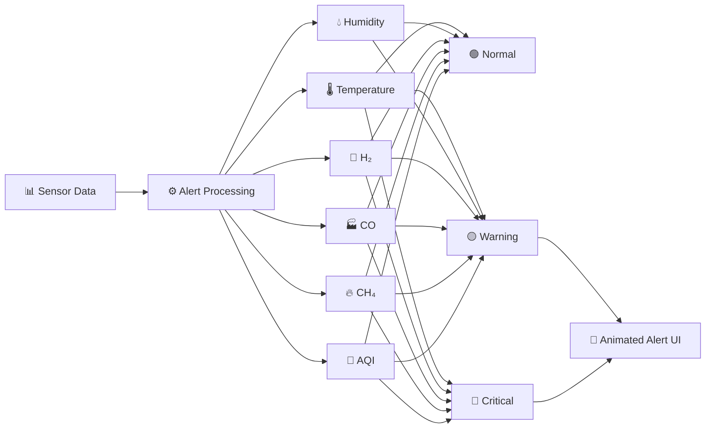

---

# 🎬 Animated UI

SmartHaven 2.0 uses **React Native Reanimated** to make the interface feel interactive and responsive.

The animations are not only decorative; they are used to improve transitions, feedback and visual hierarchy.

---

# ✨ Animation System

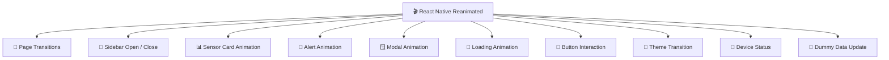

---

# 🎞️ Animated Experience

### 📄 Page Entry

```text
Page Load
   ↓
Opacity 0
   ↓
Fade In
   ↓
Slide Up
   ↓
Content Visible
```

### 📊 Dashboard Cards

```text
Dashboard
    ↓
Card 1
    ↓
Card 2
    ↓
Card 3
    ↓
Card 4
    ↓
Staggered Appearance
```

### 🚨 Alerts

```text
Alert Triggered
      ↓
Scale
      ↓
Fade In
      ↓
Attention State
      ↓
Dismiss
      ↓
Fade Out
```

---

# 🎨 UI / UX Design

SmartHaven is designed as a modern environment monitoring dashboard.

### Design principles

```text
          🏠 SMART HAVEN UI
                  │
       ┌──────────┼──────────┐
       │          │          │
       ▼          ▼          ▼
    Clarity    Feedback    Motion
       │          │          │
       ▼          ▼          ▼
    Data UI     Alerts     React Native Reanimated
       │          │          │
       └──────────┼──────────┘
                  ▼
             Better UX
```

---

# 🎨 UI Features

* ✨ Modern dashboard cards
* 🌙 Dark Mode
* ☀️ Light Mode
* 🧭 Responsive Sidebar
* 📱 Responsive Dashboard
* 🎬 Smooth transitions
* 🚨 Custom alerts
* 🪟 Custom modals
* 🔄 Loading states
* 📡 Device status
* 👤 User profile
* ⏱️ Last updated information
* 🎯 Interactive controls
* 🧪 Demo mode indicator

---

# ✨ Core Features

## 🔐 Authentication

* Firebase email/password authentication
* Login UI
* Validation
* Error handling
* Protected dashboard
* Logout
* Demo login

---

## 🏠 Smart Dashboard

Dashboard provides a centralized view of the environment.

Includes:

* Temperature
* Humidity
* H₂
* CO
* CH₄
* AQI
* Device status
* Last updated time

---

## 📡 Device Management

* Device ID input
* Device validation
* Device claiming
* Connection state
* Device status
* Real-time device updates

---

## 🌿 Environment Monitoring

SmartHaven monitors:

```text
🌡️ Temperature
💧 Humidity
💨 H₂
🏭 CO
🔥 CH₄
🌿 AQI
```

---

## 🧪 Demo Mode

* Dummy user
* Dummy device
* Dummy sensor values
* Simulated updates
* No hardware required
* UI testing
* Project demonstration

---

## 🌙 Theme

* Light Mode
* Dark Mode
* Theme-aware components
* Smooth theme transition

---

## 📱 Responsive

Designed for:

* 🖥️ Mobile
* 💻 Tablet
* 📱 Tablet
* 📱 Mobile

---

# 🛠️ Technology Stack

## ⚛️ Mobile App

| Technology          | Purpose                |
| ------------------- | ---------------------- |
| ⚛️ React Native Native         | Mobile App application   |
| 🟨 JavaScript       | Application logic      |
| 🎨 NativeWind     | UI styling             |
| 🧭 React Native Router DOM | Mobile navigation |
| 🎬 React Native Reanimated    | Animations             |
| 🧩 Lucide React Native Native     | Icons                  |
| ⚡ Expo              | Development and build  |

---

## ⚙️ Backend

| Technology    | Purpose                    |
| ------------- | -------------------------- |
| 🟢 Node.js    | Backend runtime            |
| 🚂 Express.js | REST API                   |
| ⚡ Socket.IO   | Real-time communication    |
| 🌐 CORS       | Cross-origin communication |
| 🔑 dotenv     | Environment configuration  |

---

## 🔥 Firebase

Used for:

* 🔐 Authentication
* 🔄 Realtime Database
* 👤 User management
* ☁️ Cloud services

---


---

# 🤖 IoT Stack

| Component          | Purpose                  |
| ------------------ | ------------------------ |
| 🧠 ESP32 DevKit V1 | Main IoT controller      |
| 🌡️ DHT11          | Temperature and humidity |
| 💨 MQ-02           | Gas detection            |
| 📺 OLED Display    | Local sensor information |

---

# 🧩 Complete Technology Mindmap

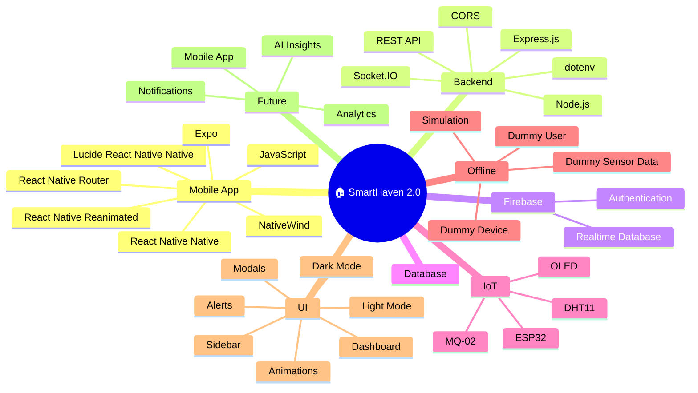

---

# 📦 Dependencies

## Mobile App Packages

```text
react
expo-router
firebase
socket.io-client
react-native-reanimated
lucide-react-native
```

## Backend Packages

```text
express
socket.io
cors
dotenv
firebase-admin
```

---

# 📊 Monitoring Parameters

| Parameter        | Sensor / Source | Unit      | Dashboard |
| ---------------- | --------------- | --------- | :-------: |
| 🌡️ Temperature  | DHT11           | °C        |     ✅     |
| 💧 Humidity      | DHT11           | %         |     ✅     |
| 💨 H₂            | MQ-02           | Gas Level |     ✅     |
| 🏭 CO            | MQ-02           | Gas Level |     ✅     |
| 🔥 CH₄           | MQ-02           | Gas Level |     ✅     |
| 🌿 AQI           | Processed Data  | Index     |     ✅     |
| 📡 Device Status | Device          | State     |     ✅     |
| ⏱️ Last Updated  | Application     | Time      |     ✅     |

---

# 📂 Project Structure

```text
SmartHaven-2.0/
│
├── 📁 mobile/
│   │
│   ├── 📁 public/
│   │   ├── 📁 screenshots/
│   │   └── 📁 demo/
│   │
│   └── 📁 src/
│       │
│       ├── 📁 assets/
│       │
│       ├── 📁 components/
│       │   ├── Sidebar.jsx
│       │   ├── DashboardHeader.jsx
│       │   ├── SensorCard.jsx
│       │   ├── Alert.jsx
│       │   ├── Modal.jsx
│       │   └── ...
│       │
│       ├── 📁 pages/
│       │   ├── Login.jsx
│       │   ├── Dashboard.jsx
│       │   └── ...
│       │
│       ├── 📁 services/
│       │   ├── firebase.js
│       │   └── socket.js
│       │
│       ├── 📁 db/
│       │   └── dummyData.js
│       │
│       ├── 📁 hooks/
│       │
│       ├── 📁 context/
│       │
│       ├── App.js
│       └── app.json
│
├── 📁 backend/
│   │
│   ├── 📁 config/
│   ├── 📁 controllers/
│   ├── 📁 routes/
│   ├── 📁 models/
│   ├── 📁 services/
│   │
│   ├── server.js
│   └── package.json
│
├── 📁 iot/
│   ├── 📁 esp32/
│   ├── 📁 sensors/
│   └── README.md
│
├── 📄 README.md
├── 📄 STEP.md
├── 📄 .gitignore
└── 📄 package.json
```

---

# 🚀 Installation

## 1️⃣ Clone Repository

```bash
git clone https://github.com/your-username/smarthaven-2.0.git
```

```bash
cd smarthaven-2.0
```

---

# ⚛️ Mobile App Setup

Navigate to mobile:

```bash
cd mobile
```

Install packages:

```bash
npm install
```

Start development server:

```bash
npx expo start
```

Mobile App will be available at:

```text
Expo Development Server
```

---

# ⚙️ Backend Setup

Open another terminal:

```bash
cd backend
```

Install dependencies:

```bash
npm install
```

Start backend:

```bash
npx expo start
```

Backend:

```text
http://localhost:5000
```

---

# 🔑 Environment Variables

## Mobile App `.env`

```env
VITE_BACKEND_URL=http://localhost:5000

VITE_FIREBASE_API_KEY=your_api_key
VITE_FIREBASE_AUTH_DOMAIN=your_auth_domain
VITE_FIREBASE_PROJECT_ID=your_project_id
VITE_FIREBASE_STORAGE_BUCKET=your_storage_bucket
VITE_FIREBASE_MESSAGING_SENDER_ID=your_sender_id
VITE_FIREBASE_APP_ID=your_app_id
```

---

## Backend `.env`

```env
PORT=5000


FIREBASE_PROJECT_ID=your_project_id
FIREBASE_CLIENT_EMAIL=your_client_email
FIREBASE_PRIVATE_KEY=your_private_key
```

> ⚠️ Never commit `.env` files or Firebase private credentials to GitHub.

---

# 🧪 Running Demo Mode

SmartHaven can run without physical hardware.

### Step 1 — Start Mobile App

```bash
cd mobile
npx expo start
```

### Step 2 — Open Application

```text
Expo Development Server
```

### Step 3 — Use Demo Login

Use the application's demo login functionality.

### Step 4 — Dummy Device

The application loads the dummy device configuration.

### Step 5 — Sensor Simulation

The dummy engine generates changing environmental values.

### Step 6 — Dashboard

The simulated data appears inside the sensor cards.

```text
🧪 Dummy Generator
       ↓
📊 Sensor Values
       ↓
⚛️ React Native State
       ↓
🏠 Dashboard
       ↓
🚨 Alerts
```

---

# 🔄 Application Lifecycle

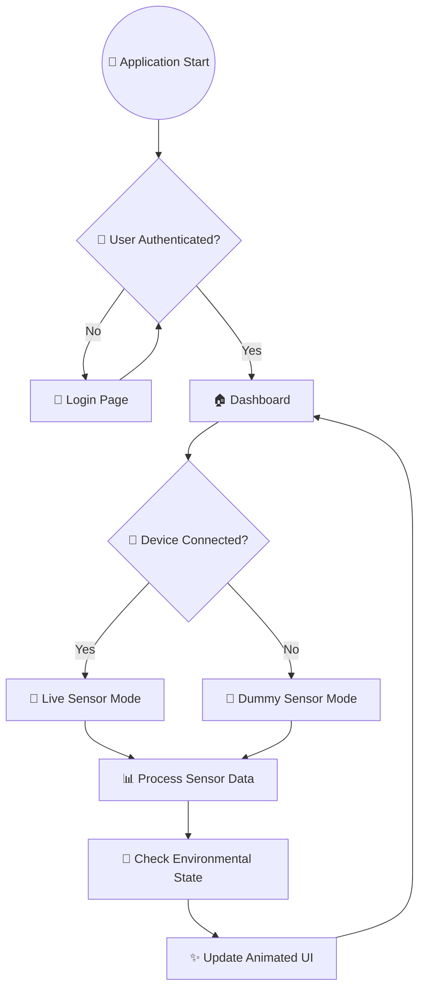

---

# 📸 Screenshots

Create the following directory:

```text
mobile/public/screenshots/
```

Recommended screenshots:

```text
login.png
dashboard.png
dark-mode.png
device-claim.png
alerts.png
mobile.png
```

---

## 🔐 Login Screen

```markdown

```

---

## 🏠 Dashboard

```markdown

```

---

## 🌙 Dark Mode

```markdown

```

---

## 🔗 Device Claiming

```markdown

```

---

## 🚨 Alerts

```markdown

```

---

## 📱 Mobile

```markdown

```

---

# 🎥 Project Demo

For a more professional GitHub presentation, add a GIF or short screen recording.

Recommended structure:

```text
mobile/
└── public/
    └── demo/
        └── smarthaven-demo.gif
```

Then add:

```markdown
<p align="center">


</p>
```

### Recommended demo sequence

```text
🔐 Login
   ↓
🏠 Dashboard
   ↓
🧭 Sidebar
   ↓
🌙 Dark Mode
   ↓
📡 Device Status
   ↓
🧪 Dummy Sensor Updates
   ↓
🚨 Alert
   ↓
📊 Monitoring
```

---

# 📱 Responsive Design

SmartHaven is designed to adapt to different screen sizes.

```text
                  🏠 SMART HAVEN
                         │
          ┌──────────────┼──────────────┐
          │              │              │
          ▼              ▼              ▼
       🖥️ Mobile      💻 Tablet      📱 Mobile
          │              │              │
          ▼              ▼              ▼
     Drawer / Sidebar    Responsive UI   ☰ Sidebar
          │              │              │
          ▼              ▼              ▼
       Dashboard      Dashboard      Compact Cards
```

### Mobile

* Full navigation
* Multi-column sensor cards
* Large dashboard
* Complete monitoring information

### Tablet

* Responsive card layout
* Adaptive sidebar
* Optimized spacing

### Mobile

* Collapsible sidebar
* Compact cards
* Mobile header
* Touch-friendly controls

---

# 🌙 Theme System

SmartHaven includes both Light and Dark themes.

## ☀️ Light Mode

Designed for bright environments with a clean interface.

## 🌙 Dark Mode

Designed for comfortable monitoring in low-light environments.

Theme-aware elements include:

```text
🧭 Sidebar
📌 Header
📊 Sensor Cards
🚨 Alerts
🪟 Modals
🎯 Buttons
📄 Pages
🏠 Dashboard
```

---

# 📡 Device Status

The dashboard provides different visual device states.

```text
🟢 ONLINE

Device is connected and available.


🟡 CONNECTING

Connection is being established.


🔴 OFFLINE

Device is currently unavailable.


🧪 DEMO

Dummy / simulated sensor mode is active.
```

---

# 📊 Monitoring Overview

```text
                         🏠 SMART HAVEN
                                │
             ┌──────────────────┼──────────────────┐
             │                  │                  │
             ▼                  ▼                  ▼
       🌡️ Temperature      💧 Humidity          🌿 AQI
             │                  │                  │
             └──────────────────┼──────────────────┘
                                │
                     ┌──────────┴──────────┐
                     │                     │
                     ▼                     ▼
                  💨 H₂                   🏭 CO
                     │                     │
                     └──────────┬──────────┘
                                │
                                ▼
                             🔥 CH₄
                                │
                                ▼
                         🚨 Alert System
                                │
                                ▼
                          ⚛️ Dashboard
```

---

# 🧪 Testing

SmartHaven can be tested at multiple layers.

## Mobile App Testing

Check:

* Login UI
* Dashboard
* Sidebar
* Theme switching
* Responsive layout
* Sensor cards
* Alerts
* Modals
* Loading states
* Dummy mode

---

## Backend Testing

Check:

* Server startup
* API communication
* Authentication validation
* Device claiming
* Database connectivity
* Socket.IO connection

---

## IoT Testing

Check:

* ESP32 connection
* DHT11 readings
* MQ-02 readings
* OLED display
* Network communication
* Backend communication

---

## Offline Testing

Check:

```text
🧪 Dummy Login
      ↓
🧪 Dummy Device
      ↓
🧪 Sensor Simulation
      ↓
📊 Dashboard
      ↓
🚨 Alerts
```

---

# 🔒 Security

SmartHaven follows basic application security practices.

### 🔐 Authentication

Firebase Authentication provides the authentication layer.

### 🔑 Environment Variables

Sensitive values should be stored in `.env`.

### 🛡️ Protected APIs

Backend routes can validate authenticated requests.

### 🏠 Device Validation

Device IDs should be validated before device claiming.

### 🚫 Secrets

Never commit:

```text
.env
Private Keys
Passwords
API Secrets
Firebase Admin Credentials
Database Credentials
```

---

# 🗺️ Development Roadmap

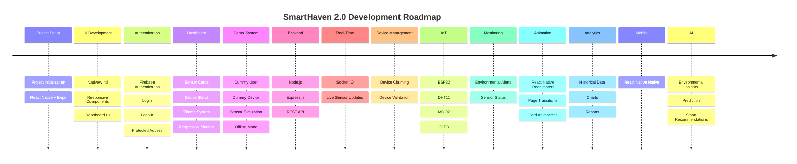

---

# 📈 Future Analytics

Future versions can include:

* 📊 Historical sensor data
* 📈 Interactive charts
* 📅 Daily reports
* 📅 Weekly reports
* 📅 Monthly reports
* 🔍 Data filtering
* 📤 Data export
* 📉 Environmental trends

---

# 🤖 Future AI Features

Potential future AI functionality:

```text
                🤖 AI ENGINE
                     │
        ┌────────────┼────────────┐
        │            │            │
        ▼            ▼            ▼
   📊 Analysis   🔍 Anomaly    🔮 Prediction
        │         Detection        │
        │            │              │
        └────────────┼──────────────┘
                     ▼
              💡 Smart Insights
                     │
                     ▼
                👤 User
```

Potential features:

* Environmental trend analysis
* Anomaly detection
* AQI prediction
* Smart recommendations
* Environmental summaries
* Pattern detection

---

# 📱 Future Mobile Application

A future React Native Native application can provide:

* 📱 Mobile dashboard
* 🔐 Authentication
* 📡 Device management
* 📊 Sensor monitoring
* 🚨 Push notifications
* 📈 Analytics
* 🌙 Dark mode

---

# 🏠 Future Multi-Device Architecture

SmartHaven can eventually support multiple devices.

```text
                         👤 User
                           │
                           ▼
                    🏠 SmartHaven
                           │
             ┌─────────────┼─────────────┐
             │             │             │
             ▼             ▼             ▼
         📡 Device 1   📡 Device 2   📡 Device 3
             │             │             │
             ▼             ▼             ▼
          Room 1        Room 2        Room 3
             │             │             │
             └─────────────┼─────────────┘
                           ▼
                     📊 Central Dashboard
```

---

# 📚 Development Documentation

The project development process is documented in:

```text
STEP.md
```

The document follows the chronological development process of SmartHaven.

```text
01. Project Setup
        ↓
02. Mobile App Setup
        ↓
03. Tailwind Configuration
        ↓
04. Application Routing
        ↓
05. Firebase Setup
        ↓
06. Authentication
        ↓
07. Login UI
        ↓
08. Dashboard
        ↓
09. Sidebar
        ↓
10. Dark / Light Mode
        ↓
11. Sensor Cards
        ↓
12. Dummy Mode
        ↓
13. Dummy Sensor Generator
        ↓
14. Backend Setup
        ↓
15. REST API
        ↓
16. Socket.IO
        ↓
17. Device Claiming
        ↓
18. IoT Integration
        ↓
19. Real-Time Data
        ↓
20. Alerts
        ↓
21. Animations
        ↓
22. Testing
        ↓
23. Deployment
```

---

# 📝 Development Philosophy

SmartHaven is being developed around three major principles:

### 1. 🧩 Modular

Components and services should remain reusable and maintainable.

### 2. ⚡ Real-Time

Environmental data should be available to the dashboard with minimal delay.

### 3. 🎨 User-Friendly

Complex sensor information should be represented through simple visual interfaces.

---

# 🌐 Deployment Architecture

The application can be deployed using separate mobile and backend services.

```text
                         🌍 INTERNET
                              │
                 ┌────────────┴────────────┐
                 │                         │
                 ▼                         ▼
          ☁️ Mobile App                 ☁️ Backend
             Vercel                    Render
                 │                         │
                 ▼                         ▼
             ⚛️ React Native                Node.js API
                 │                         │
                 │                    ⚡ Socket.IO
                 │                         │
                 └────────────┬────────────┘
                              │
                   ┌──────────┴──────────┐
                   │                     │
                   ▼                     ▼
```

---

# 🚀 Production Checklist

Before deployment:

```text
☐ Configure production environment variables

☐ Configure Firebase Authentication

☐ Configure Firebase database


☐ Configure backend URL

☐ Configure CORS

☐ Test authentication

☐ Test device claiming

☐ Test Socket.IO

☐ Test dummy mode

☐ Test responsive UI

☐ Test dark mode

☐ Test alerts

☐ Remove development secrets

☐ Build mobile

☐ Deploy backend

☐ Deploy mobile

☐ Test production application
```

---

# 🤝 Contributing

Contributions, improvements and suggestions are welcome.

### 1️⃣ Create a branch

```bash
git checkout -b feature/your-feature
```

### 2️⃣ Make changes

```bash
git add .
```

### 3️⃣ Commit changes

```bash
git commit -m "Add your feature"
```

### 4️⃣ Push branch

```bash
git push origin feature/your-feature
```

### 5️⃣ Create Pull Request

Open a Pull Request with a clear description of your changes.

---

# 🐛 Bug Reports

When reporting an issue, include:

```text
1. Description of the problem

2. Steps to reproduce

3. Expected behavior

4. Actual behavior

5. Browser / device

6. Console error

7. Screenshots if available
```

---

# 💡 Feature Requests

Feature requests should include:

```text
Feature Name
        ↓
Problem
        ↓
Proposed Solution
        ↓
Expected Benefit
```

---

# 📄 License

This project is currently intended for:

* Educational purposes
* IoT experimentation
* Development
* Project demonstrations
* Learning
* Portfolio purposes

A formal open-source license can be added according to the project's final distribution requirements.

---

# 👨‍💻 Developer

<div align="center">

# Abhishek Kumar Jaiswar

### React Native Developer • Full Stack Developer • IoT • AI/ML

<br/>

<a href="https://github.com/abhishekkjaiml">

</a>

<a href="https://www.linkedin.com/in/abhishek-kumar-jaiswar-aiml/">

</a>

<br/><br/>


</div>

---

<div align="center">

# 🌿 SmartHaven 2.0

<p align="center">


</p>

<p align="center">

**🌿 Monitor • 📡 Connect • ⚡ Analyze • 🧪 Simulate • 🏠 Improve**

</p>

<p align="center">


</p>

---

<div align="center">

### 🏠 Built with ❤️ by Abhishek Kumar Jaiswar

**SmartHaven 2.0 — Monitor smarter. Live better.**

</div>

</div>
